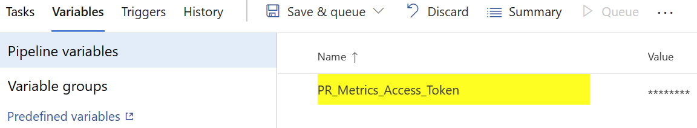

# Azure Pipelines Task

The task can be added to a pipeline as detailed
[in the Azure Pipelines documentation][addingtask].

The Azure Pipelines task can run against Azure or GitHub repositories.

For Azure repositories, the task will require access to the PR resources. The
recommended solution is to use workload identity federation as this is more
maintainable and secure. For more information, see the
[workload identity federation instructions][workloadidentityfederation].

Alternatively, you can use Personal Access Tokens (PATs). For this, you can try
remapping `System.AccessToken` to `PR_Metrics_Access_Token` using

```yaml
env:
  PR_METRICS_ACCESS_TOKEN: $(System.AccessToken)
```

However, the scope of `System.AccessToken` may be limited by your system
administrator. In this case, you will need to create a new Personal Access
Token (PAT) with scopes 'Code' > 'Read & write' and 'Pull Request Threads' >
'Read & write', which you can then map to `PR_Metrics_Access_Token`.

For GitHub repositories, you will need to create a PAT according to the
instructions [in the GitHub documentation][githubpat] with at least Read and
Write access to pull requests. If you are using a Classic PAT, it will need at
least the 'repos' scope. The resulting PAT should then be added to your
repository as a secret with the name `PR_Metrics_Access_Token` according to the
instructions [in the GitHub documentation][githubsecret] and mapped to
`PR_Metrics_Access_Token` within the task definition. Alternatively, you can use
the in-built `GITHUB_TOKEN`.

It is recommended to run the task as one of the first operations in your build,
after code check out is complete. Running the task early in the build process
allows for the title to be updated quickly, avoiding the need for engineers to
wait a long time for the title update.

## YAML

The default input values are expected to be appropriate for most builds.
Therefore, the following YAML definition is recommended:

```yaml
steps:
- task: ms-omex.prmetrics.prmetrics.PRMetrics@1
  displayName: PR Metrics
  env:
    PR_METRICS_ACCESS_TOKEN: $(PR_Metrics_Access_Token)
  continueOnError: true
```

If you wish to modify the inputs, YAML akin the to the following can be used:

```yaml
steps:
- task: ms-omex.prmetrics.prmetrics.PRMetrics@1
  displayName: PR Metrics
  env:
    PR_METRICS_ACCESS_TOKEN: $(PR_Metrics_Access_Token)
  inputs:
    BaseSize: 200
    GrowthRate: 2.0
    TestFactor: 1.0
    AlwaysCloseComment: true
    FileMatchingPatterns: |
      **/*
      !Ignore.cs
    CodeFileExtensions: |
      cs
      ps1
  continueOnError: true
```

## Classic Pipelines

For classic pipelines, you need to specify the secret as an environment
variable.

First, create a new environment variable in the pipeline definition under the
variables tab with the name `PR_Metrics_Access_Token` and the value of the PAT
as outlined above. Mark the variable as a secret to ensure it is not exposed in
the logs.



Then, add the task to the pipeline and expose the secret as an environment
variable. To do this, expand the "Environment Variables" section and press "+"
to add a new variable. In the first text box, add `PR_METRICS_ACCESS_TOKEN` and
in the second, add `$(PR_Metrics_Access_Token)`.


You can use a name other than `PR_Metrics_Access_Token` if you wish, but you
will need to keep the name unified across the variable and task definitions. The
name `PR_METRICS_ACCESS_TOKEN` cannot be altered.

## Git History

If your repository contains _any_ non-linear history, it will be necessary to
fetch Git history during checkout. This can be done by updating the `checkout`
step:

```yaml
- checkout: self
  fetchDepth: 0
```

Alternatively, if using classic pipelines, you can disable 'Shallow fetch' under
the build process phase settings.

In many cases, `fetchDepth` will not be required so it is recommended not to set
this unless the task explicitly requests it. It may also be possible to set this
to a value greater than 0 if you only require a partial history, but it can be
difficult to determine a value that will work consistently, due to the nature of
Git history.

To avoid this, it is recommended to only use commit types that squash the Git
history such as ["squash merge" or "rebase and fast-forward"][squashmerge].

## Always Close Comment

By default, the comment is left open if it requires further attention, such as
when a smaller PR or increased test coverage is suggested. If the
`AlwaysCloseComment` option is set to `true`, the comment will be closed, to
prevent it blocking automatic closure of the PR.

[addingtask]: https://docs.microsoft.com/azure/devops/pipelines/customize-pipeline
[githubpat]: https://docs.github.com/github/authenticating-to-github/keeping-your-account-and-data-secure/creating-a-personal-access-token
[githubsecret]: https://docs.github.com/actions/reference/encrypted-secrets
[squashmerge]: https://learn.microsoft.com/azure/devops/repos/git/merging-with-squash
[workloadidentityfederation]: workload-identity-federation.md
