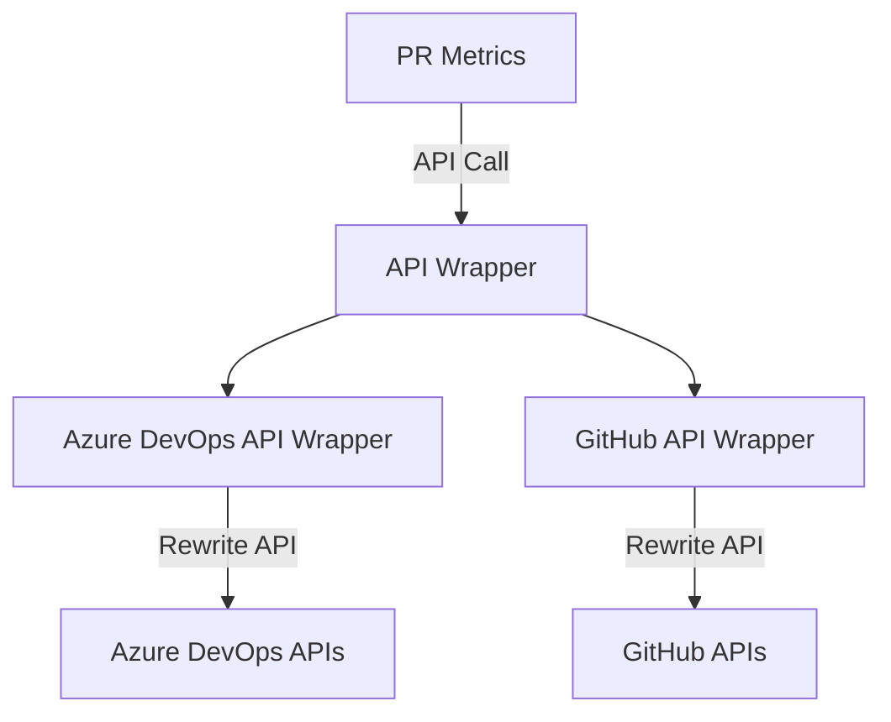

# Cross-Platform Architecture

PR Metrics has a single, unified codebase that can be hosted as an Azure DevOps
extension or as a GitHub action. The Azure DevOps extension can process PRs
created on either the Azure DevOps or GitHub platforms.

To support this cross-platform design, all calls to the underlying system and to
the platform hosting the PR are made through a series of wrappers. The top-level
wrapper checks the platform and subsequently routes the call through to the
appropriate lower-level wrapper, which in turn calls into the platform APIs.

In a few cases, there are discrepancies between the different platforms in terms
of supported concepts. For instance, it is possible to add a comment to the
first changed line of a review using the Azure DevOps APIs but not using the
GitHub Octokit APIs. To resolve this particular issue, extra logic was added to
read the diff associated with a PR and to then process it using the
[`OctokitGitDiffParser`][octokitgitdiffparser] class. Solutions such as these
insulate the top-level code from the need to manage API differences.

## Building the Code

Further issues arise during the building of the code. The GitHub runner uses
relatively recent versions of Node.js, with plans
[to migrate from Node.js v12 to Node.js v16 by Summer 2023][nodejsmigration].
The Azure DevOps runner currently only uses Node.js v10.24.1. v10 does not
support all recent ECMAScript features, which creates a problem for some
dependencies.

In particular, the [`@octokit/oauth-app`][octokitoauthapp] package, which is an
indirect dependency of the Octokit APIs, uses ECMAScript constructs that will
fail to be processed when the script is invoked. In other words, use of the
constructs will result in a failure of PR Metrics even if the offending code is
never reached.

One solution would have been to prevent updates to the `@octokit/oauth-app`
package being consumed by PR Metrics and to remain on v4.0.8 indefinitely. This
was originally used as an interim solution. However, if a security flaw were
detected in the old version of `@octokit/oauth-app`, it would not be possible to
update the package to resolve it, leading to potential supply chain risks for
those using PR Metrics. This solution would also mean that changes to the
underlying Octokit APIs could not be easily accommodated.

To resolve this, the build process was adapted.

1. After compiling the TypeScript code in ECMAScript, the result is merged into
   a single file by [ncc][ncc].
2. The code is then processed using [Babel][babel] to transpile newer ECMAScript
   concepts into older ones.
3. The transpiled code includes unused dependencies, which are then removed by
   another ncc execution.

This process is only used for the Azure DevOps build. As GitHub does not require
transpilation, the process was skipped for the GitHub code creation to keep code
more modern and code sizes smaller.

[babel]: https://babeljs.io/
[ncc]: https://www.npmjs.com/package/@vercel/ncc
[nodejsmigration]: https://github.blog/changelog/2022-09-22-github-actions-all-actions-will-begin-running-on-node16-instead-of-node12/
[octokitgitdiffparser]: ../src/task/src/git/octokitGitDiffParser.ts
[octokitoauthapp]: https://www.npmjs.com/package/@octokit/oauth-app
