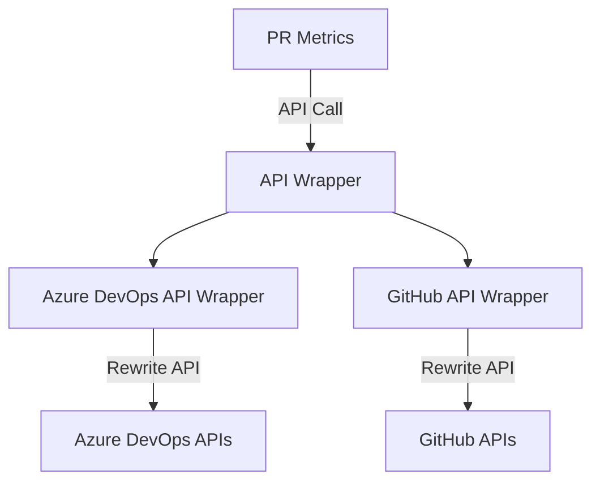

# Cross-Platform Architecture

PR Metrics has a single, unified codebase that can be hosted as an Azure DevOps
extension or as a GitHub Action. The Azure DevOps extension can process PRs
created on either the Azure DevOps or GitHub platforms.

To support this cross-platform design, all calls to the underlying system and to
the platform hosting the PR are made through a series of wrappers. The top-level
wrapper checks the platform and subsequently routes the call through to the
appropriate lower-level wrapper, which in turn calls into the platform APIs.

```mermaid
graph TD
  1[PR Metrics] --> |API Call| 2[API Wrapper]
  2 --> 3a[Azure DevOps API Wrapper]
  2 --> 3b[GitHub API Wrapper]
  3a --> |Rewrite API| 4a[Azure DevOps APIs]
  3b --> |Rewrite API| 4b[GitHub APIs]
```

In a few cases, there are discrepancies between the different platforms in terms
of supported concepts. For instance, it is possible to add a comment to the
first changed line of a review using the Azure DevOps APIs but not using the
GitHub Octokit APIs. To resolve this particular issue, extra logic was added to
read the diff associated with a PR and to then process it using the
[`OctokitGitDiffParser`][octokitgitdiffparser] class. Solutions such as these
insulate the top-level code from the need to manage API differences.

## Building the Code

The build process compiles TypeScript to ECMAScript and then bundles the result
into a single file using [ncc][ncc]. Both the GitHub Action and Azure DevOps
extension use the Node.js 24 execution handler.

[ncc]: https://www.npmjs.com/package/@vercel/ncc
[octokitgitdiffparser]: ../src/task/src/git/octokitGitDiffParser.ts
