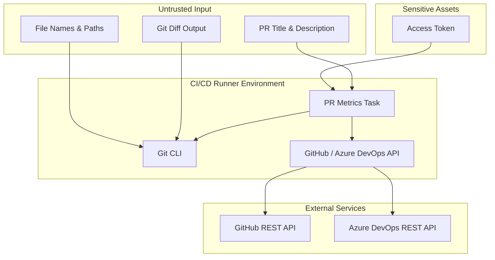

# Security Assessment

This document describes the security assessment for [PR Metrics][prmetrics],
identifying the most likely and impactful potential security problems and the
mitigations in place.

## System Overview

PR Metrics is a CI/CD task that runs within GitHub Actions or Azure DevOps
Pipelines. It analyzes pull request diffs to calculate code size and test
coverage metrics, then updates the PR title and adds a summary comment.

The task operates within the CI/CD runner's execution environment and
communicates with platform APIs (GitHub REST API or Azure DevOps REST API) using
an access token provided by the pipeline.

## Trust Boundaries

## Assets

- **Access token** (High): `GITHUB_TOKEN` or PAT granting PR read/write access.
- **PR title & description** (Low): Attacker-controlled content read and
  partially written back.
- **Git diff output** (Low): Line counts parsed from `git diff --numstat`
  output.
- **PR comments** (Low): Metrics comments written to the PR.

## Threat Analysis

### 1. Access Token Exposure

**Threat**: The access token could be logged, leaked through error messages, or
exfiltrated by a compromised dependency.

**Likelihood**: Low

**Impact**: High – an exposed token could allow unauthorized modifications to
pull requests or repository contents within the token's permission scope.

**Mitigations**:

- CI workflows are typically configured to pass the platform-provided
  `secrets.GITHUB_TOKEN` (or an Azure DevOps PAT) into
  `PR_METRICS_ACCESS_TOKEN`. When using `secrets.GITHUB_TOKEN`, the token is
  scoped to the current repository and expires after the workflow run. The task
  itself reads only the `PR_METRICS_ACCESS_TOKEN` environment variable and does
  not automatically fall back to `GITHUB_TOKEN`.
- Tokens are passed via environment variables (`PR_METRICS_ACCESS_TOKEN`), not
  command-line arguments, preventing exposure in process listings.
- The CI/CD workflows use `permissions: {}` at the top level, granting no
  permissions by default; each job requests only the specific permissions it
  needs.
- [Gitleaks][gitleaks] scans prevent accidental secret commits.

### 2. Injection via Untrusted PR Content

**Threat**: Maliciously crafted PR titles, descriptions, or filenames could
inject unexpected content when the task writes back to the PR.

**Likelihood**: Low

**Impact**: Medium – could result in misleading PR metadata or unexpected API
behavior.

**Mitigations**:

- The task prepends a fixed-format size indicator (e.g., `XS`, `L`) and test
  symbol (e.g., `✔`, `⚠️`) to the existing PR title without interpreting
  title content as executable code.
- Comments are written via the platform REST API, which treats content as
  data, not executable markup.
- Git diff output is parsed using `--numstat` format, which produces
  structured numeric output (additions, deletions, filename), reducing the
  attack surface from arbitrary diff content.

### 3. Supply Chain Attacks on Dependencies

**Threat**: A compromised or malicious npm package in the dependency tree could
execute arbitrary code within the CI/CD runner.

**Likelihood**: Low

**Impact**: High – could lead to data exfiltration, token theft, or pipeline
manipulation.

**Mitigations**:

- The `package-lock.json` file pins exact dependency versions, preventing
  unexpected updates.
- [CodeQL][codeql] analyzes the codebase for security vulnerabilities on every
  pull request.
- Dependencies are updated through a controlled process during releases, using
  [npm-check-updates][npmcheckupdates], with changes reviewed in a pull request.
- The release build bundles all dependencies into a single file via
  [@vercel/ncc][vercelncc], reducing the runtime dependency surface.
- Release artifacts are signed with [Sigstore][sigstore] and include
  [SLSA build provenance attestations][slsa], allowing downstream consumers to
  verify artifact integrity.

### 4. CI/CD Permission Escalation

**Threat**: The task could be configured with excessive permissions, allowing
unintended access to repository resources.

**Likelihood**: Low

**Impact**: Medium – could allow modifications beyond the intended PR scope.

**Mitigations**:

- All workflows set `permissions: {}` at the top level, defaulting to no
  permissions.
- Individual jobs request only the minimum permissions required (e.g.,
  `pull-requests: write` for PR modification, `statuses: write` for status
  checks).
- The task's Azure DevOps marketplace listing requests only `vso.code_write`
  scope.

### 5. Git Command Injection

**Threat**: The task executes
`git diff --numstat --ignore-all-space origin/<target>...pull/<id>/merge`,
where `<target>` and `<id>` are derived from the CI/CD environment. A
manipulated branch name or PR identifier could inject additional Git arguments.

**Likelihood**: Very low

**Impact**: Medium – could lead to unintended Git operations within the runner
environment.

**Mitigations**:

- Branch names and PR identifiers are sourced from CI/CD environment variables
  set by the platform, not from customer-controlled input parameters.
- The values are passed through the
  [Azure Pipelines Task SDK][azurepipelinestasksdk] or
  [@actions/exec][actionsexec] execution libraries, which handle argument
  escaping.

## Residual Risks

- **Platform vulnerabilities**: The task depends on the security of the GitHub
  Actions and Azure DevOps runner environments. Vulnerabilities in these
  platforms are outside the project's control.
- **Transitive dependency risks**: While direct dependencies are reviewed, deep
  transitive dependencies may introduce vulnerabilities that are not immediately
  apparent.

## Review Cadence

This assessment should be reviewed and updated when significant new features
are added, when the threat landscape changes, or at least annually.

[actionsexec]: https://github.com/actions/toolkit/tree/main/packages/exec
[azurepipelinestasksdk]: https://github.com/microsoft/azure-pipelines-task-lib
[codeql]: https://codeql.github.com/
[gitleaks]: https://github.com/gitleaks/gitleaks
[npmcheckupdates]: https://www.npmjs.com/package/npm-check-updates
[prmetrics]: https://github.com/microsoft/PR-Metrics
[sigstore]: https://www.sigstore.dev/
[slsa]: https://slsa.dev/
[vercelncc]: https://github.com/vercel/ncc
