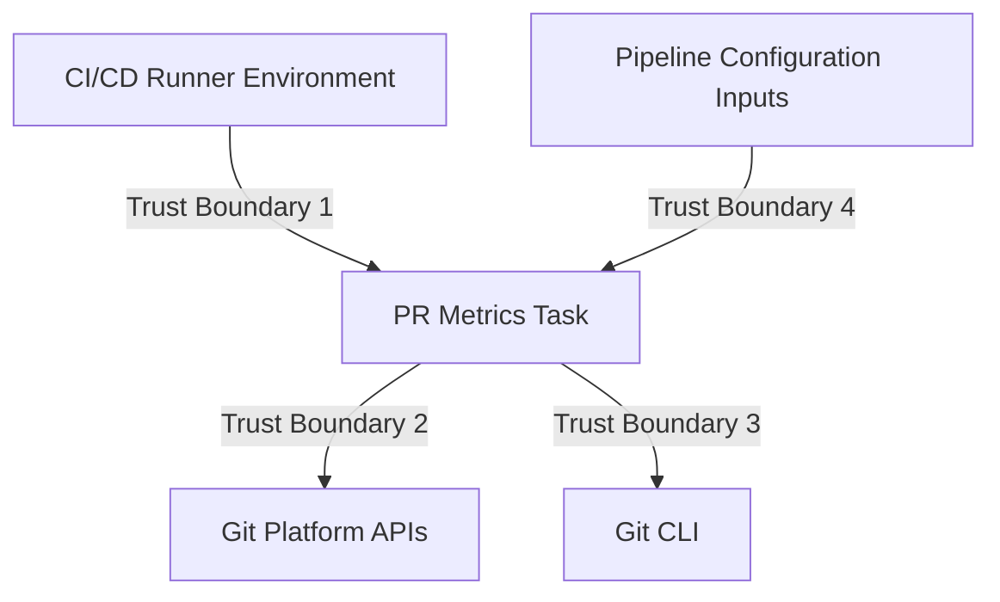

# Security Assurance Case

This document provides an assurance case for PR Metrics, justifying how the
project's security requirements are met. It includes a threat model, trust
boundary identification, and an argument that secure design principles and
common security weakness mitigations have been applied.

## Overview

PR Metrics is a GitHub Action and Azure DevOps Pipelines task that augments
pull request titles with size and test coverage indicators. It runs within
CI/CD pipeline environments and interacts with Git platform APIs.

## Trust Boundaries

The following trust boundaries exist within the system:

1. **CI/CD Runner to Task**: The task runs within a CI/CD runner (GitHub
   Actions or Azure Pipelines). The runner provides environment variables,
   authentication tokens, and the execution environment.
1. **Task to Git Platform APIs**: The task communicates with GitHub or Azure
   DevOps APIs over HTTPS to read and modify pull request data.
1. **Task to Git CLI**: The task invokes Git commands to obtain diff statistics
   for the pull request.
1. **Pipeline Configuration to Task**: Pipeline operators provide configuration
   inputs (base size, growth rate, test factor, file patterns) via pipeline
   definition files.

## Threat Model

| Threat                        | Impact | Mitigation                                                                                                                     |
| ----------------------------- | ------ | ------------------------------------------------------------------------------------------------------------------------------ |
| Malicious input injection     | Medium | All inputs validated with type checking, range validation, and safe defaults ([`inputs.ts`][inputs]).                           |
| Supply chain compromise       | High   | Releases include build provenance attestation (SLSA) and cosign signatures. Dependencies monitored via Dependabot.             |
| Credential exposure           | High   | Authentication tokens provided via environment variables only. Gitleaks scanning prevents accidental secret commits.           |
| API injection via PR metadata | Medium | PR title and comment content constructed from validated metrics data, not raw external input.                                  |
| Unauthorised API access       | Medium | Minimum required permissions enforced (`pull-requests: write`, `statuses: write`). Principle of least privilege applied.       |
| Dependency vulnerabilities    | Medium | Dependabot monitors all dependencies. CodeQL scans for known vulnerability patterns on every PR.                               |
| Code quality defects          | Medium | 100% test coverage enforced via [c8 configuration][c8rc]. ESLint with 150+ strict rules. CodeQL security analysis on each PR. |

## Secure Design Principles

The following secure design principles from Saltzer and Schroeder are applied:

- **Economy of Mechanism**: The task has focused, limited functionality
  (calculating PR size metrics and updating PR titles and comments). Complexity
  is minimised.
- **Fail-Safe Defaults**: All inputs have safe default values. Invalid inputs
  fall back to defaults rather than causing failures. The task is designed to
  run with `continue-on-error: true`.
- **Complete Mediation**: All API calls go through platform-specific wrappers
  that handle authentication and authorisation consistently.
- **Least Privilege**: The task requires only `pull-requests: write` and
  `statuses: write` permissions. No elevated or administrative permissions are
  needed.
- **Least Common Mechanism**: The task does not share state between pipeline
  runs or across repositories.
- **Open Design**: The project is fully open source under the MIT licence. All
  security mechanisms are transparent and auditable.

## Common Weakness Mitigations

The following common implementation security weaknesses (referencing OWASP
Top 10 and CWE/SANS Top 25) are addressed:

- **Injection (CWE-79, CWE-89)**: The task does not construct shell commands
  from external input. Git commands use fixed arguments. API calls use typed
  SDK methods rather than string concatenation.
- **Broken Authentication (CWE-287)**: Authentication is delegated to the CI/CD
  platform. Tokens are provided via environment variables and never logged or
  stored persistently.
- **Sensitive Data Exposure (CWE-200)**: Debug logging does not output
  sensitive values. Gitleaks scanning in CI prevents accidental credential
  commits.
- **Security Misconfiguration (CWE-16)**: Secure defaults are enforced. The
  task does not require complex security configuration from pipeline operators.
- **Using Components with Known Vulnerabilities (CWE-1035)**: Dependabot
  monitors all dependencies. CodeQL scans for known vulnerability patterns.
  Automated dependency updates are enabled via the CI/CD pipeline.
- **Insufficient Logging and Monitoring (CWE-778)**: The task provides
  comprehensive debug logging when `system.debug` is enabled, including full
  method call traces for diagnostic purposes.

## Verification Mechanisms

- **Static Analysis**: CodeQL with `security-and-quality`,
  `security-experimental`, and `security-extended` query suites runs on every
  pull request.
- **Linting**: ESLint with strict TypeScript rules (150+ rules) enforced on
  every pull request via Super-Linter.
- **Secret Scanning**: Gitleaks configuration prevents accidental secret
  commits.
- **Test Coverage**: 100% statement, branch, function, and line coverage
  enforced via [c8 configuration][c8rc].
- **Release Integrity**: Build provenance attestation (SLSA framework) and
  cosign keyless signatures on all releases. Verification documentation
  provided at [`docs/verification.md`][verification].

[c8rc]: ../.c8rc.json
[inputs]: ../src/task/src/metrics/inputs.ts
[verification]: verification.md
