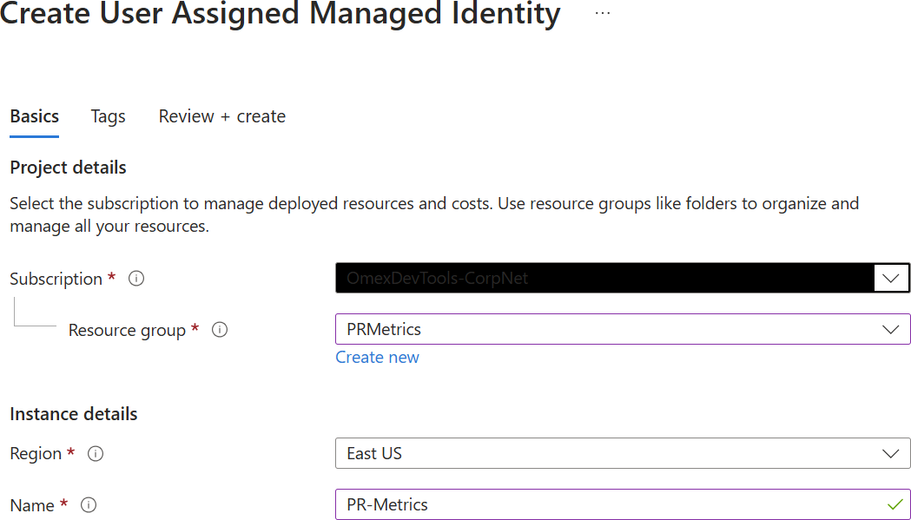
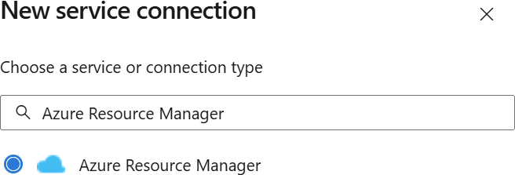
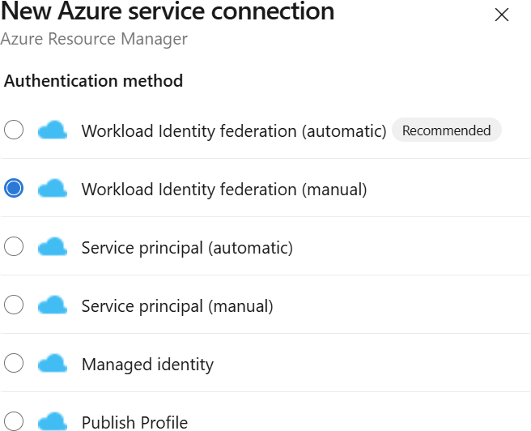
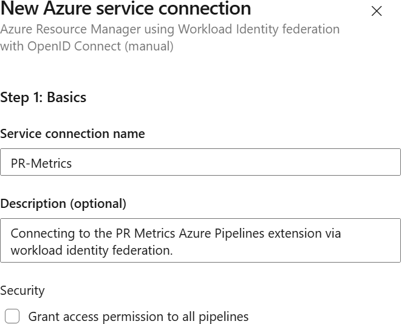
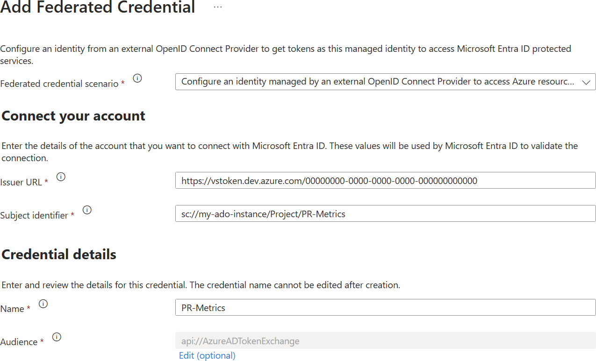
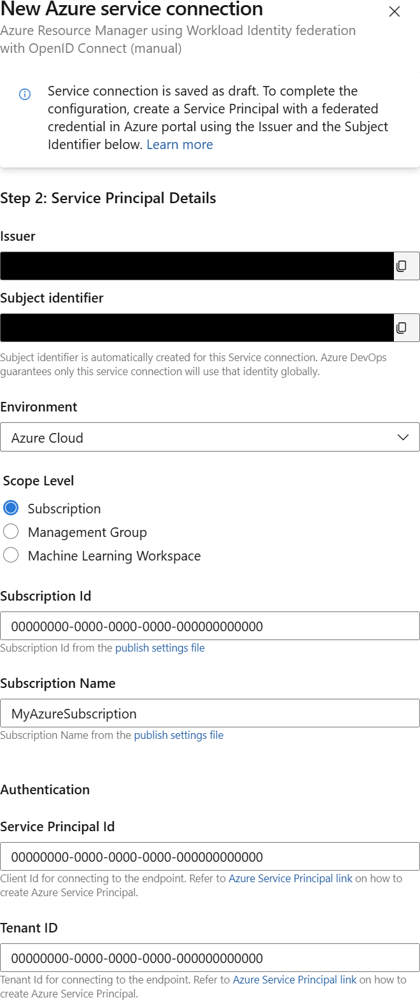

# Workload Identity Federation

Traditionally, Personal Access Tokens (PATs) have been used for authenticating
PR Metrics to Azure DevOps. However, PATs have limitations such as expiration
and security concerns. Workload identity federation provides a more secure and
scalable way to authenticate PR Metrics to Azure DevOps by using Managed
Identity.

**Note that this solution only works for PR Metrics running within Azure
Pipelines. PR Metrics running within GitHub Actions do not support workload
identity federation.**

Setting up the workload identity federation involves some effort, but it should
save ongoing maintenance.

## Prerequisites

- An Azure subscription.
- Access to create a Managed Identity in Azure.
- Access to add new users to your Azure DevOps instance.

If you don't have sufficient access, you should reach out to the appropriate
admin and provide them with these instructions.

The build agent where the PR Metrics task runs must have Azure CLI installed,
which is often already the case. If you encounter issues related to the `az`
command being unavailable, check the details about installing the Azure CLI
[here][azurecli].

## Instructions

1. Create a Managed Identity in Azure.
   1. Log into the [Azure Portal][azureportal].
   1. Use the search to locate "Managed Identities" and select it.
   1. Click "Create" to create a new managed identity.
   1. Enter the required details as appropriate:
      - Subscription
      - Resource group
      - Region
      - Name

      

   1. Click "Review + create".
   1. On the "Review + create" page, click "Create".
   1. Wait for the identity to be created.
   1. Click into the newly created managed identity to view its details.
   1. Make a note of the following fields as you will need them later:
      - Subscription
      - Subscription ID
      - Client ID
   1. Click into "Settings" > "Properties" and make a note of the "Tenant ID".

1. Create the Azure DevOps Service Connection.
   1. In a new browser tab, open your project in Azure DevOps. Retain the
      Managed Identity page in another tab as you will return to this later.
   1. At the very bottom of the left-hand menu, click on "Project settings".
   1. In the "Pipelines" section, click on "Service connections".
   1. Click "New service connection".
   1. Select "Azure Resource Manager" and click "Next".
      
   1. Select "Workload Identity federation (manual)" and click "Next".
      
   1. Enter the details as appropriate:
      - Service connection name
      - Description (optional)
      - Security: Grant access permission to all pipelines. **This is strongly
        inadvisable for security reasons.**

      

   1. Click "Next".
   1. On the second page, make a note of the following details:
      - Issuer
      - Subject identifier

1. Add the federated credential to the Managed Identity.
   1. Return to the Managed Identity you created by switching to the previously
      opened browser tab.
   1. Click into "Settings" > "Federated credentials".
   1. Click "Add Credential".
   1. For the federated credential scenario, select "Other".
   1. Enter the Issuer URL and Subject identifier from Azure DevOps.
   1. Enter an appropriate name noting that this cannot be subsequently changed.
   1. Click "Add".

   

1. Finalize the Azure DevOps Service Connection.
   1. On the pane you were previously updating, enter the details as appropriate:
      - Environment: Azure Cloud
      - Scope Level: Subscription
      - Subscription ID: Taken from the previously saved "Subscription ID".
      - Subscription Name: Taken from the previously saved "Subscription".
      - Authentication
        - Service Principal ID: Taken from the previously saved "Client ID".
        - Tenant ID: Taken from the previously saved "Tenant ID".

      

   1. Click "Verify and save".
   1. If the connection is successful, you should see a notification at the
      bottom of the screen. If the connection fails, double-check the details
      you entered and try again.
   1. It is now strongly advised to click into the service connection you
      created.
   1. Click "..." at the top right, followed by "Security".
   1. Add any users or organizations that should have access. It is strongly
      advised to limit access to only those who need it, but also to ensure that
      the connection is not lost if a user leaves the organization.

1. Add the Managed Identity as an Azure DevOps user.
   1. Navigate to your Azure DevOps home, and not that of any project.
   1. At the very bottom of the left-hand menu, click on "Organization
      settings".
   1. In the "General" section, click on "Users".
   1. Click "Add users".
   1. In the "Add new users" pane, enter the following details:
      - Users or Service Principals: Search for and select the Managed Identity
        you created using its name.
      - Access level: Basic
      - Add to projects: Select the projects in which you will be running PR
        Metrics.
      - Azure DevOps Groups: Project Contributors
      - Send email invites (to Users only): Unchecked
   1. Click "Add".

## Task Definition

To use this within Azure Pipelines, you should create a YAML definition similar
to:

```YAML
steps:
- task: ms-omex.prmetrics.prmetrics.PRMetrics@1
  displayName: PR Metrics
  inputs:
    WorkloadIdentityFederation: PR-Metrics
  continueOnError: true
```

Specify the name of the Service Connection within Azure DevOps as the
`WorkloadIdentityFederation` input. You can add any other `inputs` you wish to
specify.

[azurecli]: https://learn.microsoft.com/cli/azure/install-azure-cli
[azureportal]: https://portal.azure.com/
