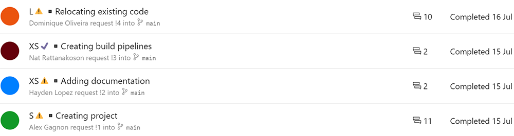
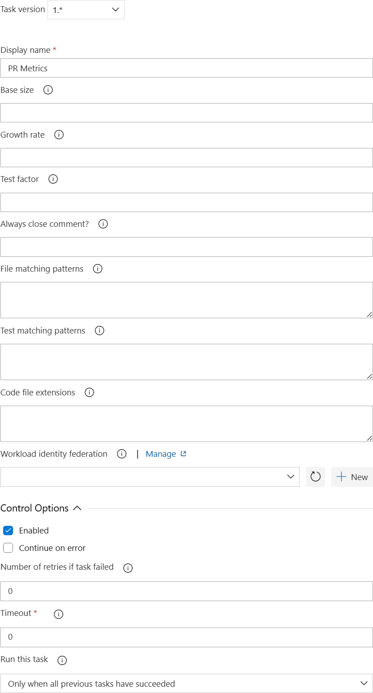

This extension provides a build task for updating PR titles with an indicator of
the PR size and test coverage. It works with Azure DevOps, GitHub, and GitHub
Enterprise PRs.

It is designed to help software engineers create PRs of an appropriate size,
with appropriate levels of test coverage. It furthermore helps reviewers
understand the time they will likely need to spend reviewing a PR, allowing for
more efficient time management.



It also adds detailed metrics as a comment within the PR, highlights missing PR
descriptions and indicates files that may not need to be reviewed.


## How to Use

After sharing the extension with your Azure DevOps instance, you can add the
task to a new or existing [build definition][build].


Or you can use YAML:

```YAML
steps:
- task: PRMetrics@1
  displayName: PR Metrics
  env:
    PR_METRICS_ACCESS_TOKEN: $(PR_Metrics_Access_Token)
  continueOnError: true
```

If you wish to modify the inputs, YAML akin the to the following can be used:

```YAML
steps:
- task: PRMetrics@1
  displayName: PR Metrics
  env:
    PR_METRICS_ACCESS_TOKEN: $(PR_Metrics_Access_Token)
  inputs:
    BaseSize: 200
    GrowthRate: 2.0
    TestFactor: 1.0
    FileMatchingPatterns: |
      **/*
      !Ignore.cs
    CodeFileExtensions: |
      cs
      ps1
  continueOnError: true
```

### Parameters

The task parameters are:

- **Base Size:** The maximum number of new lines in an extra small PR. If left
  blank, a default of `200` will be used.
- **Growth Rate:** The growth rate applied to the base size for calculating the
  size of larger PRs. If left blank, a default of `2.0` will be used. With a
  base size of `200` and a growth rate of `2.0`, `400` new lines would
  constitute a medium PR while `800` new lines would constitute a large PR.
- **Test Factor:** The lines of test code expected for each line of product
  code. If left blank, a default of `1.0` will be used. This can be set to `0.0`
  in order to skip the reporting of the test code coverage.
- **File Matching Patterns:** [Azure DevOps file matching patterns][globs]
  specifying the files and folders to include. Autogenerated files should
  typically be excluded. Excluded files will contain a comment to inform
  reviewers that they are unlikely to need to review those files. If left
  blank, a default of `**/*` (all files) will be used.
- **Code File Extensions:** Extensions for files containing code, so that
  non-code files can be excluded. If left blank,
  [a default set of file extensions will be used][defaultextensions].



## Source Code

The [source][github] for this extension is on GitHub. Take, fork, and extend.

## Privacy

The Azure DevOps extensions in this repository collect no user information.
Further information can be found in [Microsoft's privacy statement][privacy].

## Feedback & Issues

A more thorough description of the extension can be found [here][readme].

If you have feedback or encounter errors, please file an issue on
[GitHub][issues].

[build]: https://docs.microsoft.com/azure/devops/pipelines/create-first-pipeline
[globs]: https://docs.microsoft.com/azure/devops/pipelines/tasks/file-matching-patterns
[defaultextensions]: https://github.com/microsoft/PR-Metrics/blob/main/README.md#default-code-file-extensions
[github]: https://github.com/microsoft/PR-Metrics
[privacy]: https://privacy.microsoft.com/privacystatement
[readme]: https://github.com/microsoft/PR-Metrics/blob/main/README.md
[issues]: https://github.com/microsoft/PR-Metrics/issues
